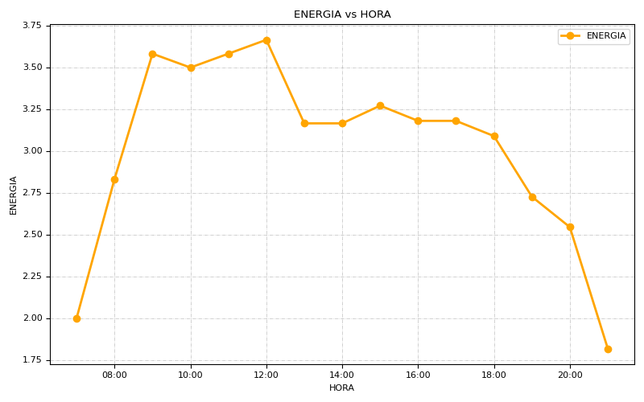

# Tool for tracking personal energy
### aka: some scripts I managed to put together into one nice-looking tool with the help of friends and the internet

main repo: [codeberg.org/olivia/energy-trackin](https://codeberg.org/olivia/energy-tracking) 
mirror repo: [github.com/nyex/energy-tracking](https://github.com/nyex/energy-tracking)

## changelog 
12 Sep 2021 (by Anjune):
- very minor streamlining of some tests

11 Sep 2021 (by Anjune):
- enabled user configuration of start and end hour
- fixed single-digit 0 having its 'leading' zero removed
- validity checks for hour, whether provided by current time or user
- validity checks for firsthour and lasthour in config file
- send error messages to STDERR as is right and proper
- replaced all if/thens on a whim

## USAGE
```
$ ent
usage --
	
record energy:
	ent <energy level, 1-5> [optional hour, 7-21]
draw pretty graph:
	ent draw
show pretty graph:
	ent show
```

## WHAT IS THIS MADNESS
This is a script that will help me keep track of my energy level, hourly, as the day goes. It's supposed to be an interesting tool if you have ADHD or if you're autistic, and have issues dealing with energy fluctuations during the day; or if you're just curious about your **best hour** or something to that effect. 

It records data to .csv files, which is a lovely human-readable format that can also be easily synced across devices and edited with a normal text editor if needed. 

The script also spits out a nice looking chart; because numbers are confusing to look at. And I like charts a lot.

## DEPENDENCIES
[graph-cli](https://github.com/mcastorina/graph-cli) for the chart generation.

You can install it with pip: `pip install graph-cli`.

## HOW IT WORKS
### setting things up

Copy the script `ent` to your $PATH and make it executable.

First time you run the script it will:

- create a default config file in `./config/entrc` if it's not there
- create a 'blank' default `energy.csv` file in your $HOME if it's not there

The default config file looks like this:

```
file=$HOME/energy.csv
average=$HOME/av-energy.csv
chart=$HOME/energy-graph.png
firsthour=7
lasthour=21
viewer=feh
```

You can create it yourself before running the script and edit the paths and your favorite image viewer accordinly if you want.

The default `energy.csv` file assumes you want to track your energy from 7h to 21h because those are the hours _I want to track myself_. Change `firsthour` and `lasthour` before running the script if you want to track different hours and the script will generate `energy.csv` according to your needs. And yes, hours must be in 24h format.

`energy.csv` is a simple .csv file that starts with just one column and looks like this:

```
07:00
08:00
09:00
10:00
11:00
12:00
13:00
14:00
15:00
16:00
17:00
18:00
19:00
20:00
21:00
```

### doing the tracking
Now let's add some numbers!

The script wants you to use a scale from 1 to 5 to measure your energy level: 1 is near-zero energy; 2 is low; 3 is ok; 4 is good energy; 5 is **awesome**. 

If you want a different scale you should edit lines 21 (usage hint) and 111 in the script. At your own risk.

Run the script with your current energy level as the argument. So you're having a great super energetic hour:

```
$ ent 5
```

DONE.

This will add a `5` to the row in `energy.csv` file that corresponds to the current hour. The idea here is to enter one number per hour. It doesn't matter if you do it at 15:00 or 15:06 or 15:59; it'll add the number to the "15:00" row.

You're supposed to do that every hour. **Set an alarm or something.**

But what if you miss an hour? Oh no!

You could of course just open `energy.csv` on your favorite editor and add the proper number to the right row. But that's probably a lot of work and you wouldn't be using a script if you didn't mind opening a file and editing. 

The script also lets you track energy for specific hours. Say you forgot to update your tracking at 14:00 and now it's 15:02. Instead of entering just the energy level, you add the hour you want to track as an extra argument, like this:

```
$ ent 4 14
```

4 because you were feeling quite energetic and that's probably why you forgot to track your energy in the first place, and 14 because that's the hour that has passed.

The script is also super smart and will understand if you type `09` or just `9` for the hour. It only understand 24h format though. Don't push it.

### doing the math
(You don't need to do any math at all. Script should take care of it.)

```
$ ent draw
```

This will spit the hourly average to a two-column .csv file (the file will get overwritten every time you run this). This file will be called `av-energy.csv` (or whatever you named it in the config file) and will have `HOUR,ENERGY` as header.

[graph-cli](https://github.com/mcastorina/graph-cli) is used for the generation of a chart in .png format. You can also fiddle with options in line 92 of the script to change color, font size and whatnot (check the tool repo for more info). I happen to like orange.

To open the chart in an image viewer ('feh' by default):

```
$ ent show
```

My own chart looked like this at one point:



### and so on and so on
The more days you keep at the tracking, the more you'll be able to see how your _average_ energy level fluctuation looks like. 

The script doesn't care about what day is today or if you have more tracking for afternoon hours and just a couple days of morning hours tracked (because it'll just calculate the average energy level for each hour), but the more entries you have, the more an _average_ calculation makes sense.

## WHY
I wanted a way to track my personal energy levels hourly to figure out how it fluctuated throughout the day. I wanted to be able to calculate the hourly average so I could have a simple little chart to look at.

There are apps that allow you to track your mood but most of them are made so you can track daily fluctuations, not hourly, so for this particular use they missed the point and didn't do me much good. 

I did find two equally named _Energy Tracker_ android apps [[this](https://play.google.com/store/apps/details?id=com.energon&hl=en_US&gl=US) and [this](https://play.google.com/store/apps/details?id=com.approvequestions.energytracker)] which do exactly what I want but do not export the data the way I wanted to (or at all), and having it restricted to the app wasn't something that suited me.

## IDEAS
I set a keyboard shortcut that runs:

```
#!/usr/bin/env bash

var=$(zenity --entry --text="⚡energy tracking")
ent $var
```

You need `zenity` installed for it to work. This will pop up a dialog box and you can enter the energy level for the current hour or energy level + hour you want to track and hit 'OK'.

## BEWARE
I'm just a nerdy artist, definitely not a programmer. I barely know basic bash. But I'm learning and this was fun to do, I had some awesome friends help me make it even more awesome, I'm happy with the results, stuff work, and thought I'd share.

## THANKS
Top contributor Anjune (gemini://anjune.lol) did magic and turned the original 3 messy scripts into a proper script. Also error catching.

[Archie](https://jonathanh.co.uk/) helped me with bash loops and bash maths and patience. Thank you!

[Drew (uoou)](https://friendo.monster/) and [Hex](https://hexdsl.co.uk/) gave me the `zenity` idea for a pop-up dialog and helped me figure out how it worked. I also steal bits of their scripts quite often.

## FEEDBACK

"PERFECTION." - My therapist, 2021.
